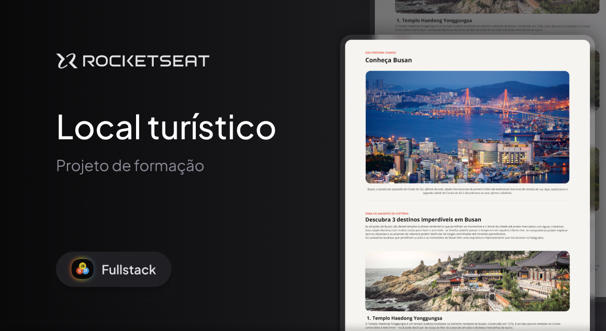

<h1 align="center"> Desafio Local Turístico</h1>

Primeiro projeto desenvolvido do curso Full-Stack da Rocketseat

## Tecnologias
<ul>
    <li>HTML5 para a estruturaçãodo conteúdo</li>
    <li>CSS3 para estilização</li>
    <li>Google Fonts para personalização tipografica</li>
</ul>

## O que pratiquei
- Estrutura semântica
- Sections e Header
- Box Model
- Pseudo-elementos
- Combinators
- Listas
- Tipografia
- Organização com CSS

## Projeto
<a href="https://kauanemota.github.io/Local-Tur-stico/">Ver projeto online</a>
